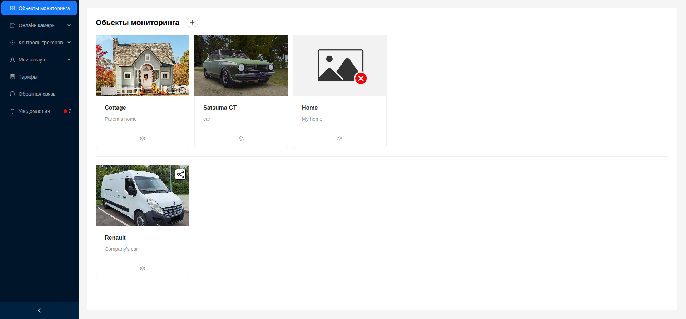
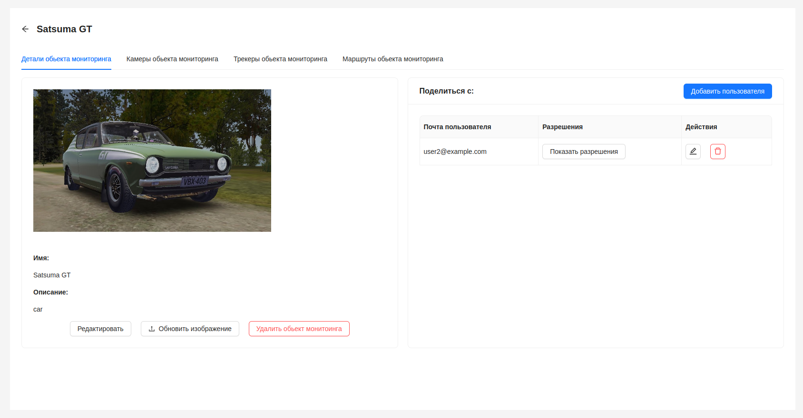
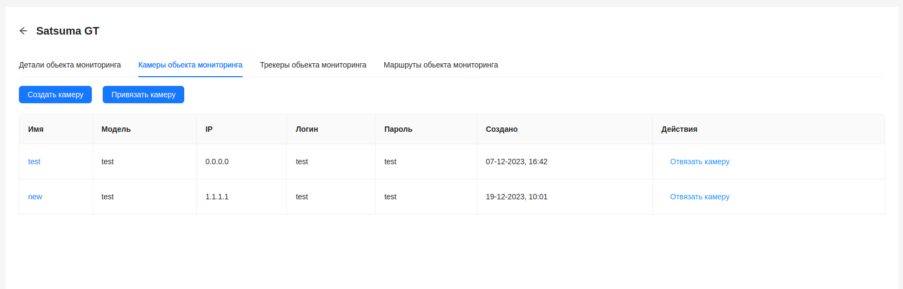
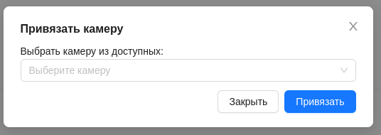
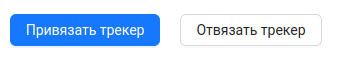
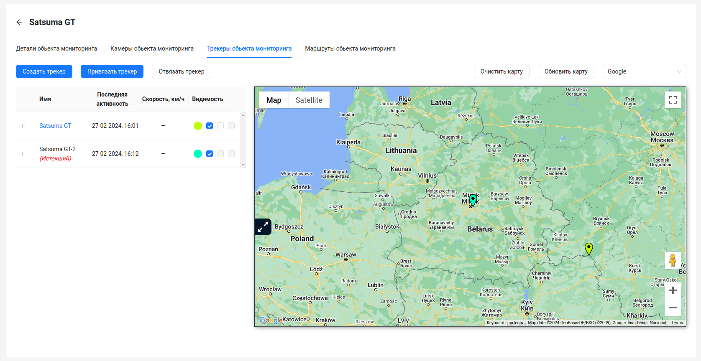
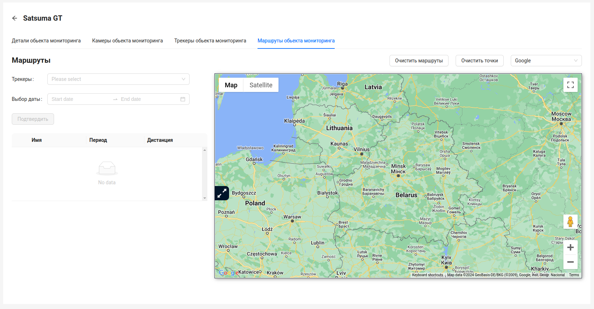

#  Обьекты мониторинга

**Объект мониторинга** - это физический объект или сущность, оборудованный специализированными устройствами, такими как GPS-трекеры и видеокамеры, которые позволяют осуществлять мониторинг в режиме реального времени или с возможностью последующего анализа. Объект мониторинга может включать в себя различные типы транспортных средств (например, автомобили, грузовики, суда), оборудование (например, промышленные машины, контейнеры) или другие объекты, требующие постоянного наблюдения и контроля для обеспечения безопасности, эффективности и оптимизации процессов.

## Интерфейс

Интерфейс представляет собой список в виде карточек. Каждый элемент обозначает обьект мониторинга, имеет изображение, наименование и краткое описание. Обьекты мониторинга, к которым предоставили доступ другие пользователи, помечены специальным значком и находятся снизу от собственных обьектов мониторинга пользователя. Подробнее о возможности поделиться обьектом мониторинга можно узнать в [соответствующем разделе](/ru/monObjects/sharing).

При клике на обьект мониторинге, пользователь может просмотреть детальную информацию.

## Детальная информация об обьекте мониторинга

Окно детальной информации обьекта мониторинга содержит в себе несколько вкладок.
1. Детали обьекта мониторинга
2. Камеры обьекта мониторинга
3. Трекеры обьекта мониторинга
4. Маршруты обьекта мониторинга

В деталях обьекта мониторинга, страница визуально разделена на 2 блока - блок с основной информацией об обьекте и блок [предоставления доступа](/ru/monObjects/sharing) к обьекту другим пользователям.

Пользователь может видеть изображение обьекта мониторинга, его наименование, краткое описание а так же панель кнопок, с помощью которых он может [редактировать](/ru/monObjects/editMonObject) обьект мониторинга либо [удалить](/ru/monObjects/deleteMonObject) его.

## Камеры обьекта мониторинга

Эта вкладка содержит список камер, которые привязаны к текущему обьекту мониторинга.

По каждой камере предоставлена следующая информация:
1. Наименование камеры - по клику произойдет переход к [детальной информации о камере](/ru/cameras).
2. Модель камеры
3. IP-адрес камеры
4. Логин
5. Пароль
6. Дата создания камеры
7. Кнопка `Отвязать камеру`, с помощью которой пользователь может отвязать камеру от текущего обьекта мониторинга, и она пропадает из списка камер.

Так же при нажатии кнопки `Создать камеру` пользователь может [создать новую камеру](/ru/cameras#создание).

При необходимости привязать существующую камеру к обьекту мониторинга, пользователю нужно нажать на кнопку `Привязать камеру` и в выпадающем списке выбрать камеру из доступных.

И нажать кнопку `Привязать`.

:::tip
При отсуствии доступных камер, пользователь увидит соответствующее сообщение.
:::

## Трекеры обьекта мониторинга

Эта вкладка содержит список трекеров, которые привязаны к текущему обьекту мониторинга.

При необходимости привязать существующий трекер к обьекту мониторинга, пользователю нужно нажать на кнопку `Привязать трекер` и в выпадающем списке выбрать трекер из доступных. Так же есть возможность отвязать трекер, с помощью соответствующей кнопки `Отвязать трекер`.

:::tip
При отсуствии доступных трекеров, пользователь увидит соответствующее сообщение.
:::

Остальной функционал **аналогичен** функционалу на странице трекеров. Подробнее можно узнать в [соответствующем разделе](/ru/trackers/intro).

## Маршруты обьекта мониторинга

Эта вкладка предоставляет возможность просматривать детальные данные о передвижении трекеров обьекта мониторинга за различные периоды времени и построить маршруты передвижения за указанный период для каждого трекера обьекта мониторинга и одновременно отображать их на карте.

 Данный функционал **аналогичен** функционалу на странице маршрутов, за исключением того, что построить маршруты возможно только по трекерам обьекта мониторинга, а не по всем имеющимся у пользователя. Подробнее можно узнать в [соответствующем разделе](/ru/trackers/routes).
