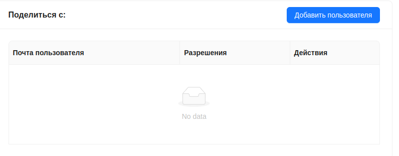
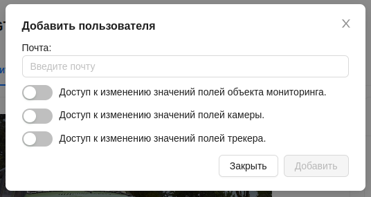
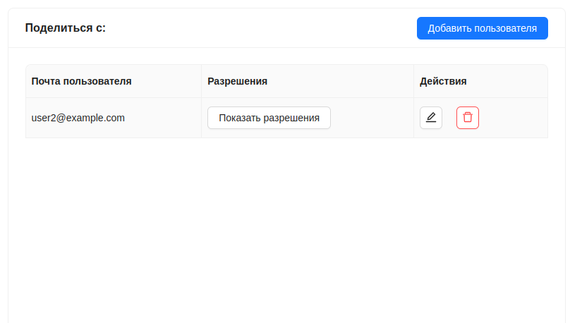
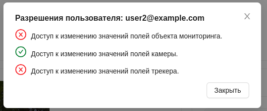
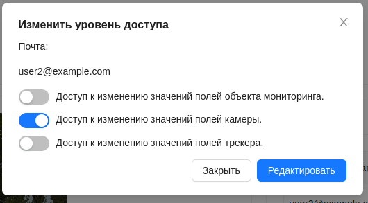
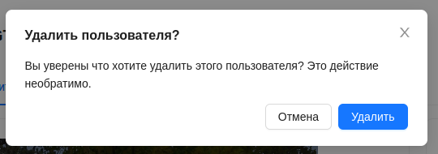
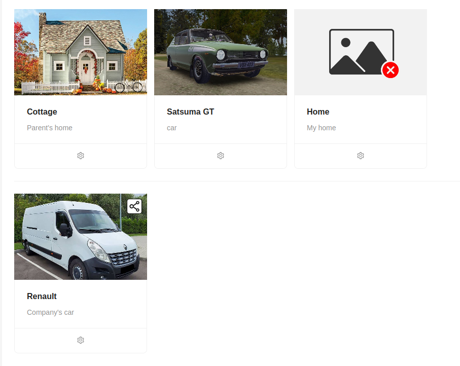

# Поделиться обьектом мониторинга

Система позволяет дать доступ к обьекту мониторинга другим пользователям(поделиться обьектом мониторинга).

При предоставлении прав доступа к обьекту мониторинга другому пользователю, ему предоставляется доступ к камерам и трекерам, которые включает в себя этот обьект мониторинга. 

Данный функционал находится на странице детальной информации обьекта мониторинга, в её правой части.

Для того чтобы поделиться обьектом мониторинга с другим пользователем, нужно нажать на кнопку `Добавить пользователя`.

После этого появится окно в котором необходимо ввести почту пользователя, с которым нужно поделиться трекером, а так же указать разрешения(права) для этого пользователя. 

После этого нужно нажать кнопку `Добавить`.

При успешном предоставлении доступа другому пользователю, у владельца в окне детальной информации по обьекту мониторинга появится информация о пользователе, которому предоставлен доступ.

Здесь пользователь - владелец трекера, может видеть почту пользователя, а так же совершить некоторые действия:

- просмотреть разрешения у этого пользователя, с помощью кнопки `Показать разрешения`

- редактировать разрешения у пользователя

- удалить пользователя из списка тех, кому предоставлен доступ к трекеру.

У пользователя, с которым поделились обьектом мониторинга, данный обьект будет отображаться в общем списке обьектов мониторинга со специальным значком. Так же таким значком помечаются трекеры и камеры, которые входят в этот обьект мониторинга, в соответствующих разделах.

:::warning Важно
Пользователь, которому предоставили доступ к обьекту мониторинга, не может поделиться им с другим пользователем или удалить этот трекер. Остальной функционал доступен ему в соответствии с выданными владельцем правами.
:::