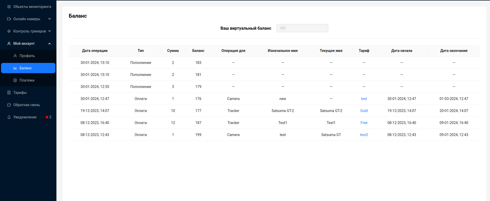

#  Баланс

Страница **Баланс** позволяет просмотреть свой виртуальный баланс а так же историю всех операций.

Пользователю могут быть предоставлены следующие данные:
- `Дата операции` - дата проведения операции
- `Тип` - пополнение баланса либо оплата по тарифу
- `Сумма` - сумма, на которую произведена операция 
- `Баланс` - значение баланса, после проведения операции
- `Операция для`* - указывает для какого устройства была произведена оплата, для камеры(Camera) или трекера(Tracker). 
- `Изначальное имя`* - наименование устройства, на момент свершения операции.
- `Текущее имя`* - текущее наименование устройства
- `Тариф`* - тариф, по которому была произведена оплата
- `Дата начала`* - дата начала действия оплаченного тарифа
- `Дата окончания`* - дата окончания действия оплаченного тарифа

*При типе операции **Пополнение** это значение равно **—**.

:::tip
При клике на оплаченный тариф, пользователь может перейти на страницу [тарифов](/ru/tariffs).
:::