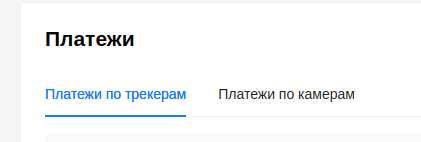
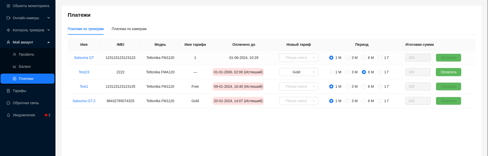
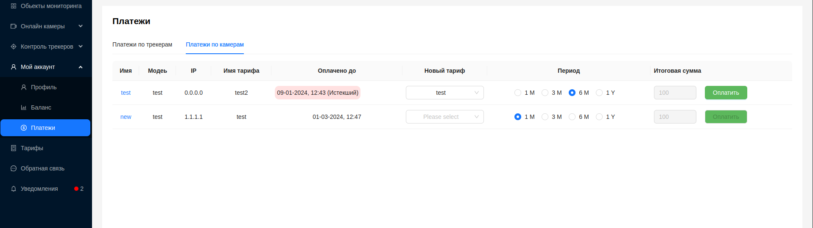

#  Платежи

Здесь пользователь имеет возможносить оплачивать трекеры и камеры по [тарифам](/ru/tariffs), которые ему предоставлены.

Страница имеет 2 вкладки - Платежи по трекерам и Платежи по камерам, для оплаты тарифов соответствующих устройств.

## Платежи по трекерам

Пользователю предоставлена следующая информация:
- `Имя` - наименование устройства. При клике, открывается окно с [детальной информацией по трекеру](/ru/trackers/intro#информация-о-трекере).
- `IMEI` - IMEI номер трекера
- `Модель` - модель трекера 
- `Имя тарифа` - наименование предыдущего/действующего тарифа
- `Оплачено до` - оплаченный период действия тарифа. Если срок действия тарифа истек, данное поле выделяется красным цветом с пометкой ***(Истекший)***
- `Новый тариф` - выпадающий список с доступными пользователю тарифами, для выбора
- `Период` - флажки для выбора пользователем срока действия оплачиваемого тарифа.

Доступные периоды:
1. 1 месяц
2. 3 месяца
3. 6 месяцев
4. 12 месяцев(1 год)
- `Итоговая сумма` - итоговая сумма к оплате по заданным пользователем параметрам
- Кнопка `Оплатить` - доступна только при выборе пользователем всех параметров

## Платежи по камерам

Пользователю предоставлена следующая информация:
- `Имя` - наименование устройства. При клике, открывается окно с [детальной информацией по камере](/ru/cameras/intro).
- `Модель` - модель камеры 
- `IP` - IP-адрес устройства
- `Имя тарифа` - наименование предыдущего/действующего тарифа
- `Оплачено до` - оплаченный период действия тарифа. Если срок действия тарифа истек, данное поле выделяется красным цветом с пометкой ***(Истекший)***
- `Новый тариф` - выпадающий список с доступными пользователю тарифами, для выбора
- `Период` - флажки для выбора пользователем срока действия оплачиваемого тарифа.

Доступные периоды:
1. 1 месяц
2. 3 месяца
3. 6 месяцев
4. 12 месяцев(1 год)
- `Итоговая сумма` - итоговая сумма к оплате по заданным пользователем параметрам
- Кнопка `Оплатить` - доступна только при выборе пользователем всех параметров

## Оплата по тарифу

Для камер и трекеров механизм оплаты по тарифам одинаковый:
1. Выбрать новый тарифа для устройства из выпадающего списка доступных, в колонке `Новый тариф`.
2. Выбрать период, на который пользователь оплачивает тариф, в колонке `Оплатить на`
3. Будет рассчитана итоговая стоимость, и отображена в колонке `Итоговая сумма`.
4. Нажать кнопку `Оплатить`.

Историю операций пользователь может просмотреть на странице [Баланс](/ru/myAccount/balance).