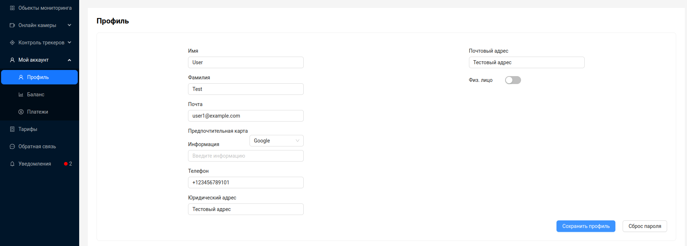
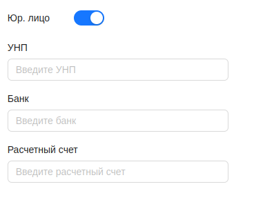

#  Профиль

Страница профиля предназначена для изменения информации о профиле пользователя, а так же содежит в себе некоторые настройки.

Пользователь может редактировать следующую информацию:

- Имя
- Фаммилия
- Почта
- Настроить предпочтительного провайдера [карт](/ru/trackers/map), который будет использоваться для отображения карт в [системе мониторинга](/ru/category/trackers)
- Дополнительная информация о пользователе
- Номер телефона
- Почтовый адрес
- указать тип пользователя(физ.лицо/юр.лицо). При выборе типа `Юр.лицо` появятся дополнительные поля для ввода данных

После изменения необходимых полей, пользователю необходимо нажать кнопку `Сохранить профиль`.

С помощью кнопки `Сброс пароля` пользователь может сбросить свой пароль для входа в систему. При нажатии на неё, будет отправлено письмо на указанную электонную почту, с инструкцией по сбросу пароля.