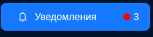
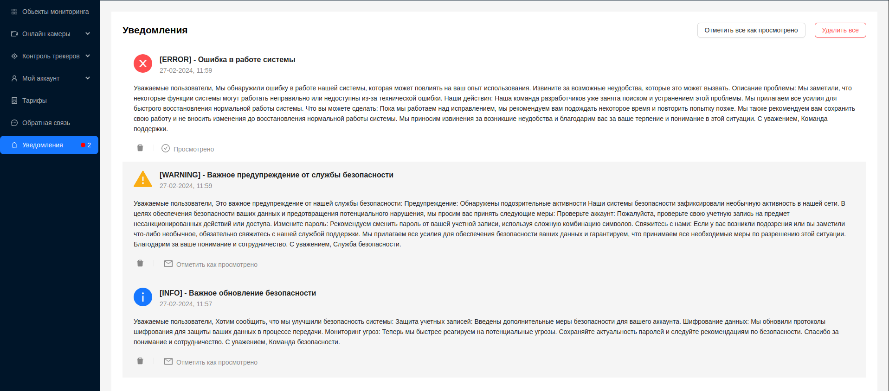
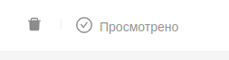
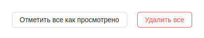

# Уведомления

При получении новых уведомление, в боковом меню будет отображаться общее количество непрочитанных уведомлений, отмеченное красным индикатором.

Страница **Уведомления** предназначена для отображения и просмотра уведомлений от системы, которые могут быть важными для пользователей. Уведомления могут включать информацию о новых функциях, обновлениях, ошибках или других событиях, требующих внимания пользователей. Не прочитанные уведомления(активные) отображаются на более темном фоне.

Каждое уведомление предоставляет пользователю следующую информацию:
1. Тип уведомления в виде изображения(информация, ошибка, предупреждение)
2. Заголовок
3. Дата создания уведомления
4. Основной текст с информацией

При получении и просмотре уведомления пользователю необходимо нажать на кнопку `Отметить как просмотрено`, чтобы убрать его из числа активных.
При этом статус уведомления измениться на **Просмотрено**.

С помощью нажатия на значок корзины, пользователь может удалить уведомление из списка.

В верхнем правом углу находятся дополнительные кнопки управления уведомлениями:

1. `Отметить все как просмотрено` - отметить все имеющиеся уведомления как просмотренные и убрать их из числа активных.
2. `Удалить все` - удалить все имеющиеся уведомления

:::tip
Управлять созданием и отправкой уведомлений может только [**Администратор**](/ru/category/admin)
:::