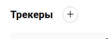
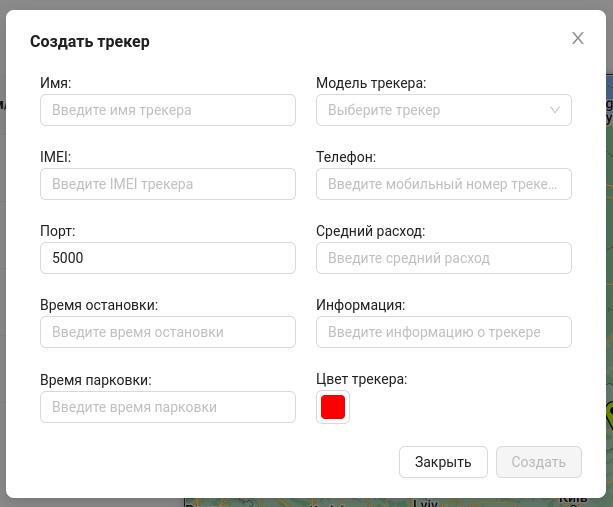

#  Добавление трекера
1. Для добавления нового gps-трекера необходимо на странице **Трекеры** нажать на кнопку вверху страницы.

2. После чего появится форма, которую необходимо заполнить:

- Имя - название трекера для определения его пользователем.
- Модель трекера - используемая модель трекера, выбирается из поддерживаемых платформой. Поддерживаемые модели может определять **Администратор**.
- IMEI - IMEI номер gps-устройства(трекера).
- Телефон - номер телефона, при наличии сим-карты у gps-устойства.
- Средний расход - среднее показания расхода топлива, для трекеров, установленных на автомобили и другой транспорт.
- Время остановки - количество секунд, при котором, если обьект прекратил свое движение, он переходит в режим остановки.
- Время парковки - количество секунд, при котором, если обьект прекратил свое движение, он переходит в режим парковки.
- Информация - дополнительная информация по трекеру, необходимая пользователю.
- Цвет трекера - цвет, которым будут обозначаться маршруты и маркер создаваемого трекера на карте.

3. Нажать кнопку `Создать`. Если данные введены верно, в списке появится созданный трекер.

