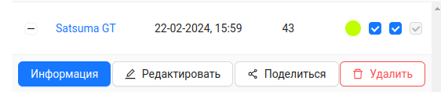
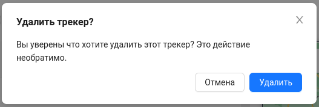

#  Удаление трекера
1. Для удаления gps-трекера необходимо на странице **Трекеры** нажать на кнопку `Удалить` у нужного трекера.

2. После чего подтвердите удаление кнопкой `Удалить`:

:::warning Внимание!
    Удалить трекер, которым поделился другой пользователь, нельзя!
:::
