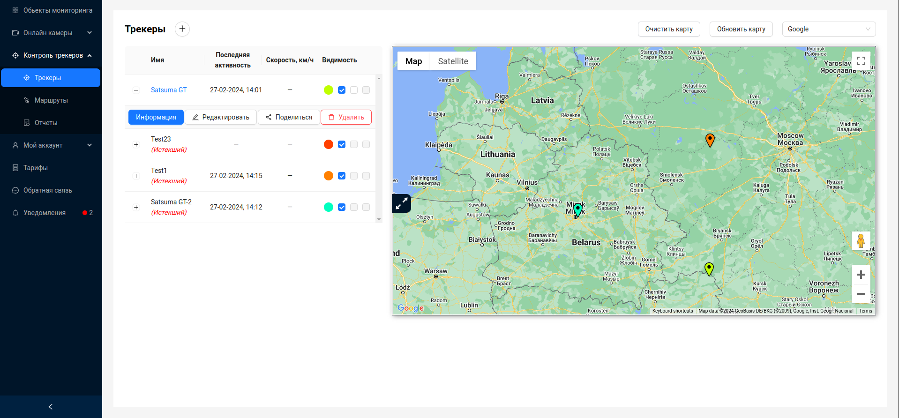
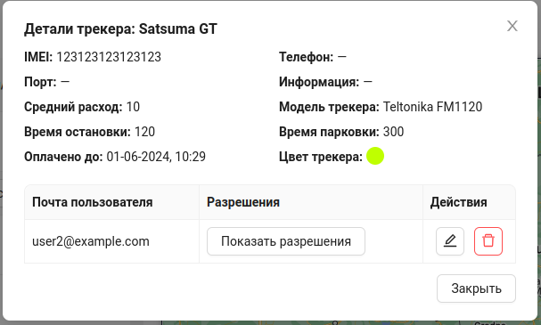
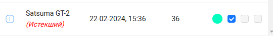
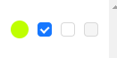
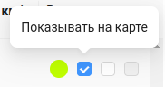
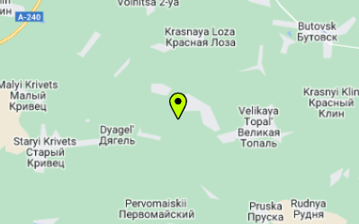
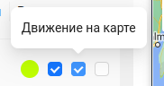
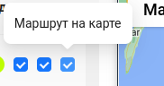
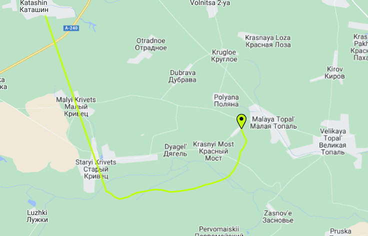
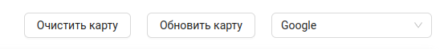

# Трекеры

**GPS-трекер** (также GPS-контроллер, трекер) — устройство приёма-передачи данных для спутникового контроля автомобилей, людей или других объектов, к которым оно прикрепляется, использующее GPS для точного определения местонахождения объекта.

Система  предназначена для контроля за объектами мониторинга, предоставления детальной информации об объектах в режиме реального времени и в режиме работы с историческими данными за указанные периоды, отображения информации об объектах на карте.

## Интерфейс

Интерфейс вкладки `Трекеры` представляет собой два визуально разделенных блока, находящихся рядом - это список трекеров пользователя и [карта](/ru/trackers/map), на которой отображаются маркерами активные трекеры.

Пользователь может видеть информацию об объекте наблюдения в режиме реального времени: наименование, дата и время последней связи объекта мониторинга с сервером, текущее местоположение, скорость передвижения объекта мониторинга при его последней связи с сервером, время остановок, заданное пользователем время паркинга, заданное пользователем, общая информация о трекере объекта, цвет маркера объекта мониторинга при его отображении на карте. 

## Информация о трекере

В таблице трекеров пользователь может видеть название трекера, дату последней активности, текущую скорость.

Более детальная информация доступна по кнопке `Информация`.

Здесь предоставлена подробная информация о gps-трекере, а так же информация о пользователях, с которыми поделился этим трекером владелец. Подробнее о функционале **Поделиться трекером** можно узнать в соответствующем [разделе](/ru/trackers/sharing).

:::tip Справка

Если оплаченное время тарифа для gps-трекера истекло, трекер помечается как `Истекший`.

:::

## Управление отображением на карте

Так же в таблице трекеров, каждый трекер имеет некоторые настройки отображения трекера на карте. Они представляют собой 3 флажка:

:::warning Порядок включения флажков

При снятом флажке `Показывать на карте` остальные флажки будут недоступны. При снятом флажке `Движение на карте` невозможно включить флажок `Маршрут на карте`. Так же при неоплаченном тарифе для текущего трекера, все флажки кроме `Показывать на карте` будут недоступны.

:::
- Флажок `Показывать на карте` позволяет включать и отключать отображение маркера трекера на карте. При включенном флажке пользователь может наблюдать маркер трекера на карте, выделенный соответствующим цветом:

       

- Флажок `Движение на карте` позволяет отслеживать движение маркеhа трекера по карте в реальном времени. 

- Флажок `Маршрут на карте` позволяет отслеживать маршрут трекера по карте. 

      

Таким образом через эти 3 флажка пользователь может управлять отображением маркеров на карте.

### Дополнительный функционал карт
Над картой расположены некоторые элементы управления:

- `Очистить карту` - очищает карту от всех маршрутов маркеров.
- `Обновить карту` - Позволяет обновить позиции всех маркеров в ручном режиме. 
- Выпадающий список для смены провайдера карт. Подробнее о поддерживаемых провайдерах можно узнать в разделе [Карта](/ru/trackers/map).

