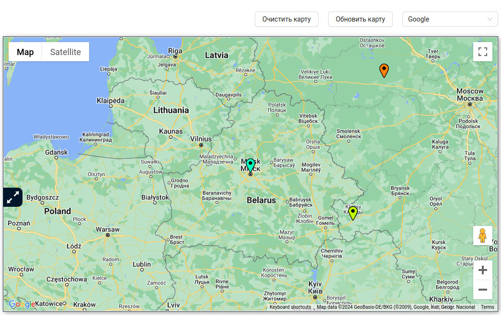
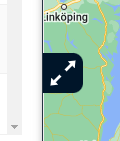
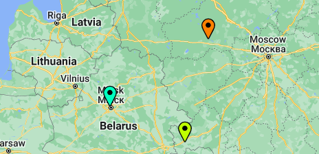

# Карта
Блок с картой в системе предназначен для отслеживания местоположения трекеров, их перемещений и отображения маршрутов.

В системе реализована поддержка следующих карт: 

- Google maps;
- Yandex maps;
- OpenStreetMap.

Сменить провайдера карт можно в верхнем правом углу с помощью выпадающего списка, либо на странице редактирвоания **Профиля**.

Так же слева на карте имеется кнопка, при нажатию на которую пользователь может увеличить блок карты.

### Маркеры

Маркеры показывают текущее местоположение gps-трекеров на карте.

