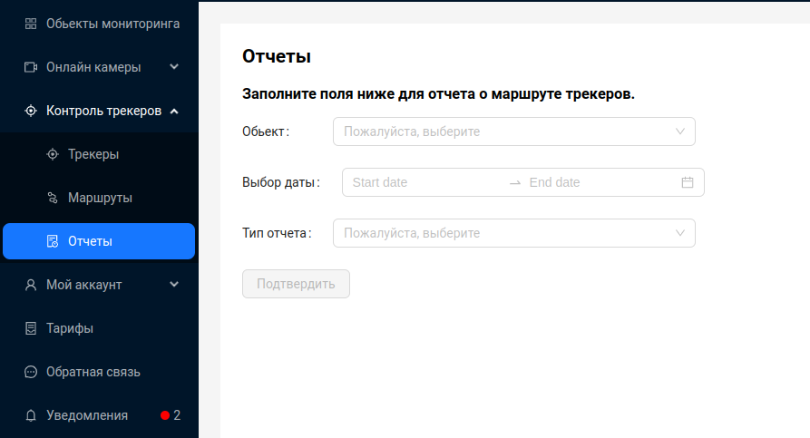
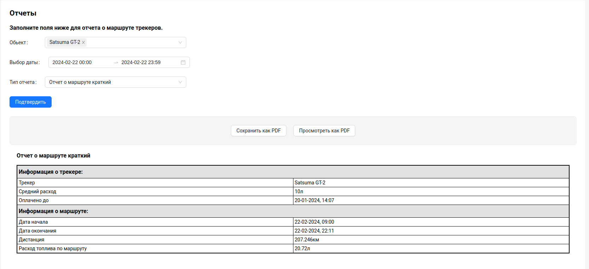
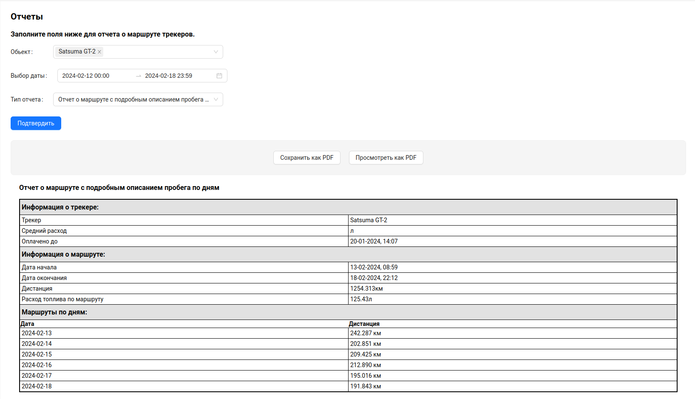
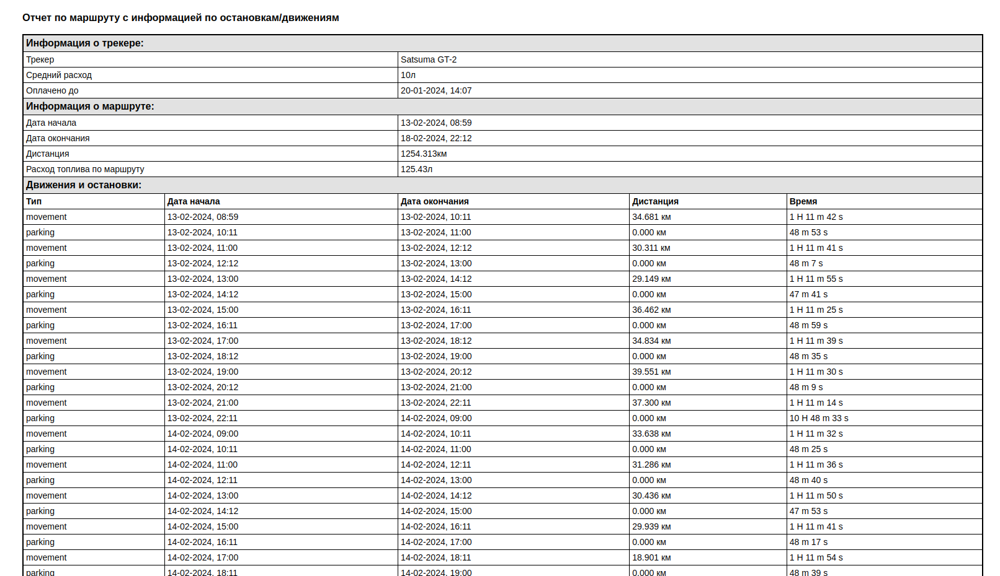
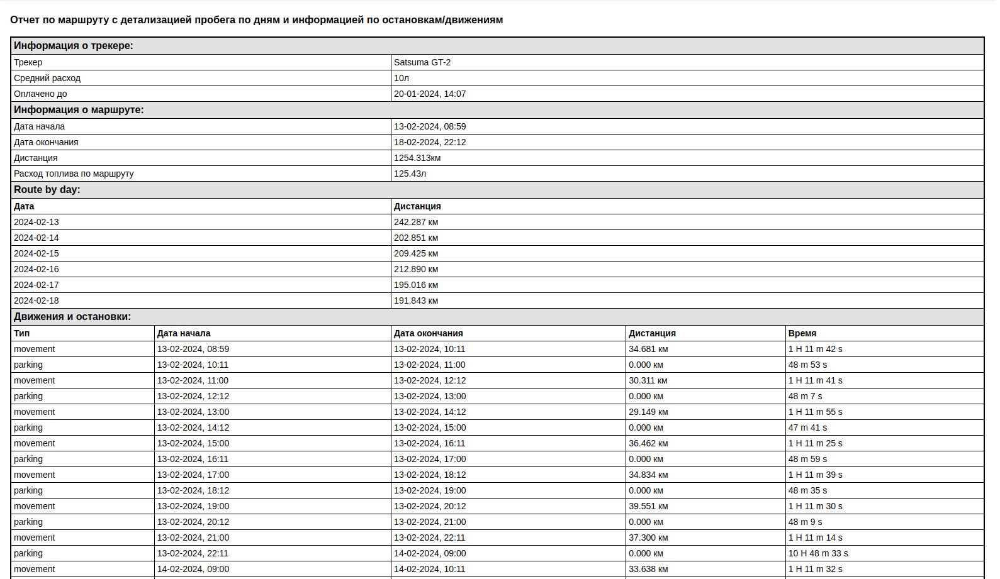

# Отчеты по трекерам

Система предоставляет возможность просматривать детальные данные о передвижении трекера за различные периоды времени и построить маршруты передвижения за указанный период для каждого трекера и одновременно отображать их на карте.

Чтобы просмотреть отчеты, необходимо на странице **Отчеты** заполнить форму.

1. Указать, для каких трекеров необходим отчет. Пользователь может выбрать несколько трекеров, воспользовавшись возможностью множественного выбора в выпадающем меню.
2. Указать период, за который нужно получить отчет.
3. Выбрать тип отчета.

В системе предусмотрено формирование следующих форм отчетов:
1. Отчет по маршруту краткий;
2. Отчет по маршруту с детализацией пробега по дням;
3. Отчет по маршруту с информацией по остановкам/движениям;
4. Отчет по маршруту с детализацией пробега по дням и информацией по остановкам/движениям.

:::tip
Пользователь может просмотреть отчет на странице, а так же скачать его как PDF или просмотреть как PDF, нажав на соответствующую кнопку. Так же из режима просмотра PDF отчет можно сразу распечатать.
:::

##  Отчет по маршруту краткий

Краткий отчет по маршруту предоставляет общую информацию, такую как:
- Средний расход транспорта, на который установлен трекер.
- Дату, до которой оплачен трекер по тарифу.
- Дату начала маршрута.
- Дату окончания маршрута.
- Дистанцию маршрута(километраж).
- Расход топлива на маршруте.

При выборе нескольких трекеров, отчет будет содержать информацию о каждом заданном трекере.

##  Отчет по маршруту с детализацией пробега по дням

Отчет по маршруту с детализацией пробега по дням предоставляет общую информацию, такую как:
- Средний расход транспорта, на который установлен трекер.
- Дату, до которой оплачен трекер по тарифу.
- Дату начала маршрута.
- Дату окончания маршрута.
- Дистанцию маршрута(километраж).
- Расход топлива на маршруте.
- Дистанцию маршрута(километраж) за каждый полный день, в указанном периоде.

При выборе нескольких трекеров, отчет будет содержать информацию о каждом заданном трекере.

##  Отчет по маршруту с информацией по остановкам/движениям

Отчет по маршруту с информацией по остановкам/движениям предоставляет общую информацию, такую как:
- Средний расход транспорта, на который установлен трекер.
- Дату, до которой оплачен трекер по тарифу.
- Дату начала маршрута.
- Дату окончания маршрута.
- Дистанцию маршрута(километраж).
- Расход топлива на маршруте.
- Информацию о движениях и остановках:
    - Тип
    - Дату начала и окончания движения/остановки
    - Дистанцию(километраж)
    - Длительность движения/остановки

При выборе нескольких трекеров, отчет будет содержать информацию о каждом заданном трекере.

##  Отчет по маршруту с детализацией пробега по дням и информацией по остановкам/движениям

Отчет по маршруту с детализацией пробега по дням и информацией по остановкам/движениям предоставляет общую информацию, такую как:

- Средний расход транспорта, на который установлен трекер.
- Дату, до которой оплачен трекер по тарифу.
- Дату начала маршрута.
- Дату окончания маршрута.
- Дистанцию маршрута(километраж).
- Расход топлива на маршруте.
- Дистанцию маршрута(километраж) за каждый полный день, в указанном периоде.
- Информацию о движениях и остановках:
    - Тип
    - Дату начала и окончания движения/остановки
    - Дистанцию(километраж)
    - Длительность движения/остановки

При выборе нескольких трекеров, отчет будет содержать информацию о каждом заданном трекере.

