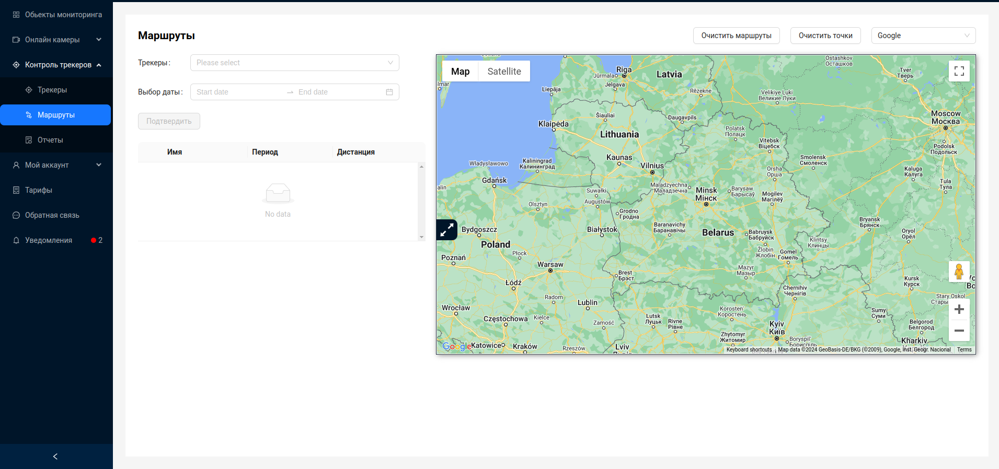
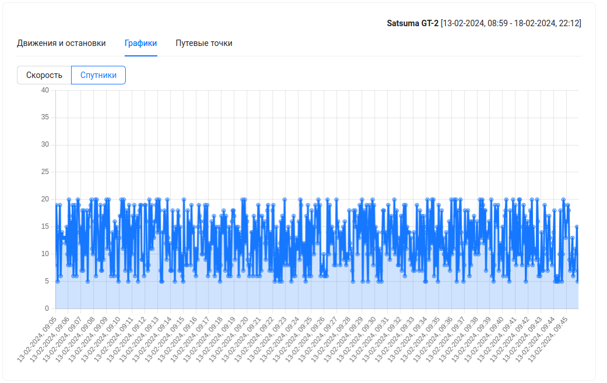

# Маршруты
Система предоставляет возможность просматривать детальные данные о передвижении трекера за различные периоды времени и построить маршруты передвижения за указанный период для каждого трекера и одновременно отображать их на карте.

## Построение маршрутов
Для построения маршрутов передвижения за определенный период времени, пользователю необходимо выбрать трекеры из доступных, а так же указать период времени. Выбор трекеров происходит из выпадающего списка. Одновременно пользователь может построить маршруты передвижения для нескольких трекеров, путем множественного выбора.

Далее пользователю необходимо нажать на кнопку `Подтвердить`.

Если за указанный период система содержит данные о передвижениях указанных трекеров, пользователю будет предоставлена информация о трекерах, периоде, за который найдены данные о передвижениях, а так же информация об общей дистанции, пройденной трекером за период времени.

Так же на карте будут построены маршруты, выделенные соответствующими цветами, за указанный период времени. Каждый маршрут по умолчанию содержит 2 маркера - маркер старта и маркер финиша, при нажатии на которые, пользователь увидит адрес местоположения трекера в этой точке.
- адрес начала маршрута:

- адрес завершения маршрута

##  Детальная информация о маршруте

Чтобы просмотреть детальную информацию о маршруте, в таблице для каждого маршрута есть 3 кнопки:
1. `Движения и остановки`
2. `Графики`
3. `Путевые точки`

При нажатии на них, на странице, под картой, появится новый блок с информацией.
Он имеет 3 вкладки, каждая из которых дублирует кнопки в таблице маршрутов.

Вверху справа указано наименование трекера и период времени, за который предоставлена инфомрация.

Из любого вида просмотра информации можно перейти на карту.

### Движения и остановки

Таблица с детальными данными по остановкам/движениям, где отображается информация с разбивкой по параметрам: остановка, паркинг и движение. По каждому параметру указывается адрес, время начала и окончания действия, итоговая дистанция (километраж) и общее затраченное время. 

По нажатию на кнопку `Показать адрес` на карте появится дополнительный маркер(2 маркера для типа ***движение***), а в таблице будет отображен адрес:
- Для остановки и парковки(parking, stop) - адрес точки остановки/парковки.
- Для движения(movement) - адреса начала и окончания движения.

:::tip
Для навигации в таблице **Движения и остановки** присуствует пагинация, с возможностью перехода по страницам и выбора количества строк на одной странице.
:::
### Графики

Пользователю доступны для просмотра 2 вида графиков:
- График скорости
- График спутников

**График скорости** отображает данные о скорости и времени. 

При клике мыши по точке графика скорости, на карту добавиться маркер с информацией и местоположении, уровне GSM сигнала, количестве спутников и скорости.

При наведении на точку графика скорости, появится всплывающее окно с значением скорости в этой точке.

**График спутников** отображает информацию о количестве спутников и времени. 

При наведении на точку графика спутников, появится всплывающее окно с количеством спутников в этой точке.

:::tip
Навигация по графику происходит с помощью мыши. Увеличить или уменьшить масштаб графиков можно вращением колеса мыши. При нахождении указателя мыши на графике, если зажать левую кнопку, то пользователь может перемещатся по графику влево/вправо.
:::
### Путевые точки

Таблица с детальными данными по каждой путевой точке, где отображается информация о дате фиксирования точки gps-устройством, адресе местоположения, скорости на момент отправки данных серверу, количестве спутников и уровню GSM сигнала.

По нажатию на кнопку `Показать адрес` на карте появится дополнительный маркер, а в таблице вместо кнопки отобразится адрес местоположения путевой точки.

:::tip
Для навигации в таблице **Путевые точки** присуствует пагинация, с возможностью перехода по страницам и выбора количества строк на одной странице.
:::
## Дополнительный функционал карт
Над картой расположены некоторые элементы управления:

- `Очистить маршруты` - очищает карту от всех маршрутов маркеров.
- `Очистить точки` - очищает карту от всех маркеров. 
- Выпадающий список для смены провайдера карт. Подробнее о поддерживаемых провайдерах можно узнать в разделе [Карта](/ru/trackers/map).

