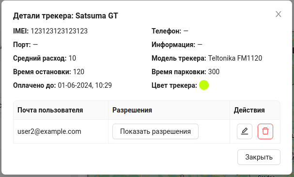

# Поделиться трекером

Система позволяет дать доступ к трекеру другим пользователям(поделиться трекером).

Для того чтобы поделиться трекером с другим пользователем, нужно нажать на кнопку `Поделиться`.

После этого появится окно в котором необходимо ввести почту пользователя, с которым нужно поделиться трекером, а так же указать разрешения(права) для этого пользователя. 

После этого нужно нажать кнопку `Добавить`.

При успешном предоставлении доступа другому пользователю, у владельца трекера в окне детальной информации по трекеру(которое открывается при нажатию на кнопку `Информация`) появится информация о пользователе, которому предоставлен доступ.

Здесь пользователь - владелец трекера, может видеть почту пользователя, а так же совершить некоторые действия:

- просмотреть разрешения у этого пользователя, с помощью кнопки `Показать разрешения`

- редактировать разрешения у пользователя

- удалить пользователя из списка тех, кому предоставлен доступ к трекеру.

У пользователя, с которым поделились трекером, данный трекер будет отображаться в общем списке трекеров со специальным значком.

:::warning Важно
Пользователь, которому предоставили доступ к трекеру, не может поделиться им с другим пользователем или удалить этот трекер. Остальной функционал доступен ему в соответствии с выданными владельцем правами.
:::